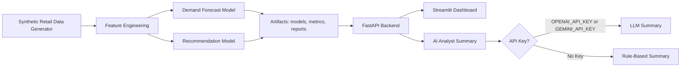

# RetailPulse AI: Forecasting & Recommendation Platform

RetailPulse AI is a production-style portfolio project that demonstrates how retail teams can combine demand forecasting, inventory risk scoring, product recommendations, anomaly detection, model explainability, and AI-assisted business summaries in one deployable application.

The app is fully self-contained: it generates a realistic synthetic retail dataset, trains models automatically, saves MLflow-style artifacts, serves predictions through FastAPI, and presents a polished Streamlit dashboard.

## Screenshots

> Add screenshots from your local run here:
>
> - `docs/screenshots/overview.png`
> - `docs/screenshots/forecast.png`
> - `docs/screenshots/model-performance.png`

## Why It Matters

Retail teams need to answer practical questions quickly:

- How much demand should we expect over the next 30 days?
- Which SKUs are at risk of stocking out?
- Did yesterday's sales spike because of a promotion or unusual demand?
- Which products should be recommended or bundled?
- Can model outputs be explained in language a business stakeholder can use?

RetailPulse AI turns those questions into a live, recruiter-friendly ML product.

## Architecture



## Features

- Interactive store, category, and SKU selectors
- Historical daily sales and next 30-day forecast
- Forecast uncertainty band
- Inventory days of cover, stockout risk, and reorder quantity
- Similar products, frequently bought together products, and bundle candidates
- Rolling z-score anomaly detection with reason labels
- Model metrics: MAE, RMSE, MAPE, R2
- Feature importance chart
- Error by product category
- API health and prediction latency
- AI Analyst panel that works with or without paid API keys
- Auto-training on first backend startup
- Docker Compose deployment

## Tech Stack

- Python, Pandas, NumPy
- FastAPI and Pydantic
- Streamlit and Plotly
- LightGBM with sklearn fallback logic
- scikit-learn recommendation and anomaly utilities
- Joblib model persistence
- Docker and Docker Compose
- Lightweight MLflow-compatible artifact structure
- pytest

## ML Methodology

The project generates two years of daily sales for 5 stores, 6 categories, and 50 SKUs. The data includes weekend seasonality, monthly seasonality, promotions, discounts, holidays, price sensitivity, noisy demand, stockout periods, demand spikes, and slow or fast-moving SKUs.

The supervised forecasting model uses tabular time-series features:

- `lag_1`, `lag_7`, `lag_14`, `lag_28`
- `rolling_mean_7`, `rolling_mean_14`, `rolling_std_7`
- calendar features
- promotion, holiday, price, discount, and inventory features
- encoded store, product, and category features

The last 60 days are held out for validation. Metrics and feature importance are saved under `backend/artifacts/metrics/`.

The recommendation system uses product demand profiles, price tier, promotion behavior, revenue, day-of-week demand shape, and category signals to compute item-item cosine similarity.

Anomaly detection uses rolling expected demand and z-scores, then classifies anomalies as spikes or drops with practical explanations such as promotion effect, weekend spike, stockout drop, price change, or unusual demand.

## Project Structure

```text
retailpulse-ai/
  README.md
  docker-compose.yml
  .env.example
  backend/
    Dockerfile
    requirements.txt
    app/
      main.py
      schemas.py
      config.py
      services/
      utils/
    artifacts/
      models/
      metrics/
      data/
      reports/
      plots/
    training/
      generate_data.py
      train_forecast_model.py
      train_recommender.py
      evaluate_model.py
  frontend/
    Dockerfile
    requirements.txt
    streamlit_app.py
    components/
  tests/
    test_api.py
```

## API Endpoints

- `GET /health` - API and model health
- `GET /metadata` - stores, categories, products, model version, training date
- `POST /forecast` - historical sales, recursive forecast, inventory risk, reorder recommendation
- `POST /recommend` - similar products, frequently bought together items, bundles
- `POST /anomalies` - anomaly table and sales series
- `POST /insights` - AI or rule-based analyst summary
- `GET /metrics` - metrics, feature importance, category errors
- `GET /docs` - Swagger API docs

## Run With Docker

```bash
cp .env.example .env
docker compose up --build
```

Then open:

- Frontend: <http://localhost:18631>
- Backend docs: <http://localhost:18632/docs>

The first backend start generates the dataset and trains the models. Later starts reuse the Docker volume artifacts.

## Run Locally Without Docker

```bash
cd retailpulse-ai
python -m venv .venv
.venv\Scripts\activate
pip install -r backend/requirements.txt
pip install -r frontend/requirements.txt

uvicorn app.main:app --app-dir backend --reload
```

In a second terminal:

```bash
set API_BASE_URL=http://localhost:8000
streamlit run frontend/streamlit_app.py
```

## Tests

```bash
pytest -q
```

The tests start the FastAPI app, trigger artifact creation when needed, and verify health, metadata, forecast, recommendations, anomalies, and insight generation.

## Server Deployment Notes

On a home server or VPS:

```bash
git clone <your-repo-url>
cd retailpulse-ai
cp .env.example .env
docker compose up --build -d
```

Expose frontend port `18631` for the dashboard and, if needed, backend port `18632` for API docs. For a public website, point your reverse proxy such as Nginx, Caddy, or Traefik to `http://localhost:18631`. Keep the `retailpulse_artifacts` Docker volume to avoid retraining on every restart.

For redeploy, forced retraining, and health-check commands, see [DEPLOYMENT.md](DEPLOYMENT.md).

## Resume Bullet

Built and deployed RetailPulse AI, an end-to-end ML platform for retail demand forecasting, anomaly detection, product recommendations, model explainability, and AI-assisted business insights using Python, LightGBM, scikit-learn, FastAPI, Streamlit, Docker, and MLflow-style experiment tracking.

## Future Improvements

- Add MLflow server integration
- Add PostgreSQL for persistent application state
- Add user-uploaded CSV inference
- Add real SHAP explanations for per-prediction explainability
- Add scheduled retraining and drift monitoring
- Add authentication for public deployment
